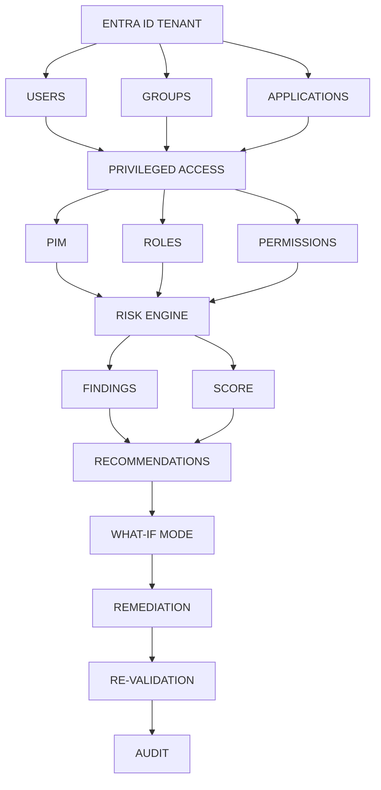

# [SHIELD] Entra ID Privileged Access & Identity Risk Assessment Toolkit

> **Mission:** Discover, assess, prioritize, explain, remediate, and continuously audit identity and privileged-access risks in Microsoft Entra ID.

A PowerShell toolkit that runs an end-to-end identity governance pipeline against Microsoft Entra ID. It moves beyond raw reporting by combining a **Risk Engine** with a **What-If simulator**, a **remediation planner**, a **guarded executor**, and a **re-validation diff** - with a **full audit trail**.

---

## [ARCH] Architecture & Flow



---

## [TARGET] What It Does

### 1. Discovery
- Enumerates **users, groups, applications** and their role assignments.
- Catalogs **PIM eligible** and **PIM active** assignments.
- Detects **permanent (non-PIM) privileged role assignments** - the #1 Entra hardening gap.

### 2. Risk Engine
- Correlates findings **per principal**.
- Applies a **weighted scoring model**: permanence x privilege x blast radius.
- Produces a single score per identity with tier classification:
  - `Critical` (80-100)
  - `High` (50-79)
  - `Medium` (25-49)
  - `Low` (<25)

### 3. What-If Simulation
- Test proposed remediations **before touching the tenant**.
- Compare before/after scores per principal.
- No Graph write access required.

### 4. Remediation
- Generates a **human-readable Markdown runbook** with concrete Entra Portal steps + Graph cmdlets.
- Executes remediations with **three safety layers** (see below).
- Writes every action to an **audit log**.

### 5. Re-Validation
- Diffs pre/post score reports.
- Flags `Resolved`, `Improved`, `Unchanged`, `REGRESSED` per principal.
- Appends a summary to the audit log - closing the loop.

---

## [START] Quick Start

### Prerequisites
- **License:** Microsoft Entra ID P2 (for PIM) or Microsoft Entra ID Governance
- **Permissions:** `Privileged Role Administrator` or `Global Administrator`
- **PowerShell:** 7+ with the `Microsoft.Graph` module

```powershell
Install-Module Microsoft.Graph -Scope CurrentUser -Force
```

### Clone

```bash
git clone https://github.com/habibnp01-prog/Entra-ID-Privileged-Access-Risk-Assessment-Toolkit.git
cd Entra-ID-Privileged-Access-Risk-Assessment-Toolkit
```

### Connect to Microsoft Graph

```powershell
Connect-MgGraph -Scopes "RoleManagement.Read.Directory","RoleManagement.ReadWrite.Directory","Directory.Read.All"
```

### Run the full pipeline

```powershell
.\scripts\Invoke-EntraRiskAssessment.ps1
```

Produces in `./output/`:
- `PIMEligibilityReport.json`
- `PermanentRoleReport.json`
- `RiskScoreReport.json`

### Generate a remediation plan

```powershell
.\scripts\Remediation\New-EntraRemediationPlan.ps1
```

### Simulate remediation (no tenant changes)

```powershell
.\scripts\RiskEngine\Invoke-WhatIfSimulation.ps1 -ScenarioPath .\scenarios\example-scenario.json
```

### Apply remediation (dry-run by default)

```powershell
# Dry run - shows what would change
.\scripts\Remediation\Invoke-EntraRemediation.ps1 -ScenarioPath .\scenarios\example-scenario.json

# Live - both -Apply AND -Confirm required
.\scripts\Remediation\Invoke-EntraRemediation.ps1 -ScenarioPath .\scenarios\example-scenario.json -Apply -Confirm
```

### Re-validate

```powershell
.\scripts\Remediation\Compare-EntraRemediationOutcome.ps1
```

---

## [LOCK] Safety Model

The remediation executor (`Invoke-EntraRemediation.ps1`) enforces:

| Layer | Guarantee |
|-------|-----------|
| **Dry-run by default** | No changes unless `-Apply` is explicitly passed |
| **-Confirm required** | Even with `-Apply`, changes need `-Confirm` - no accidental runs |
| **Last-GA guard** | Refuses to remove the last permanent Global Administrator |
| **Full audit log** | Every action written with timestamp, principal, role, result, mode |

The audit log (`./output/RemediationAudit.log`) captures both simulations and live actions - auditors can see exactly what was attempted and what was applied.

---

## [FOLDER] Repository Structure

```
scripts/
|-- Invoke-EntraRiskAssessment.ps1             # End-to-end orchestrator
|-- RiskEngine/
|   |-- Get-EntraPIMEligibilityReport.ps1      # PIM eligible + active discovery
|   |-- Get-EntraPermanentRoleReport.ps1       # Permanent role detection
|   |-- Get-EntraRiskScore.ps1                 # Weighted scoring
|   |-- Invoke-WhatIfSimulation.ps1            # Pre-remediation simulation
|   +-- Get-EntraPrivilegedAccessReport.ps1    # Basic privileged access report
+-- Remediation/
    |-- New-EntraRemediationPlan.ps1           # Markdown runbook generator
    |-- Invoke-EntraRemediation.ps1            # Guarded remediation executor
    +-- Compare-EntraRemediationOutcome.ps1    # Re-validation diff

scenarios/                                     # What-If + remediation scenarios
docs/                                          # Deep-dive documentation
images/                                        # Diagrams and screenshots
output/                                        # Generated reports (gitignored)
.github/workflows/                             # CI (PSScriptAnalyzer)
```

---

## [CHART] Risk Scoring Model

Each finding contributes a weighted score to the principal:

| Finding | Weight |
|---------|--------|
| Permanent + high-privilege role | 50 |
| Permanent + standard role | 25 |
| Active PIM + high-privilege role | 20 |
| Eligible PIM + high-privilege role | 10 |
| No-expiration eligible assignment | 5 |
| Other eligible assignment | 2 |

If a principal holds **3 or more** high-privilege roles, a **x1.5 blast-radius multiplier** is applied. Scores are capped at 100.

Tiers: `Critical >=80`, `High >=50`, `Medium >=25`, `Low <25`.

---

## [LOOP] End-to-End Workflow

```
1. Invoke-EntraRiskAssessment.ps1             -> discovery + scoring
2. Copy RiskScoreReport.json to .baseline.json -> snapshot
3. New-EntraRemediationPlan.ps1               -> read the plan
4. Invoke-WhatIfSimulation.ps1                -> simulate impact
5. Invoke-EntraRemediation.ps1                -> dry-run, then apply
6. Invoke-EntraRiskAssessment.ps1             -> re-scan tenant
7. Compare-EntraRemediationOutcome.ps1        -> diff + audit
```

---

## [TOOLS] Roadmap

See the pinned [Roadmap issue](https://github.com/habibnp01-prog/Entra-ID-Privileged-Access-Risk-Assessment-Toolkit/issues) for planned work.

**Next up:**
- Audit log CSV/HTML exporter for auditors
- Scheduled run wrapper (Azure Automation / Task Scheduler)
- HTML dashboard for findings
- Access review integration

---

## [HANDSHAKE] Contributing

Contributions welcome. Please open an issue first to discuss what you'd like to change. Ensure scripts pass `PSScriptAnalyzer`.

## [LICENSE] License

MIT License - see `LICENSE` for details.