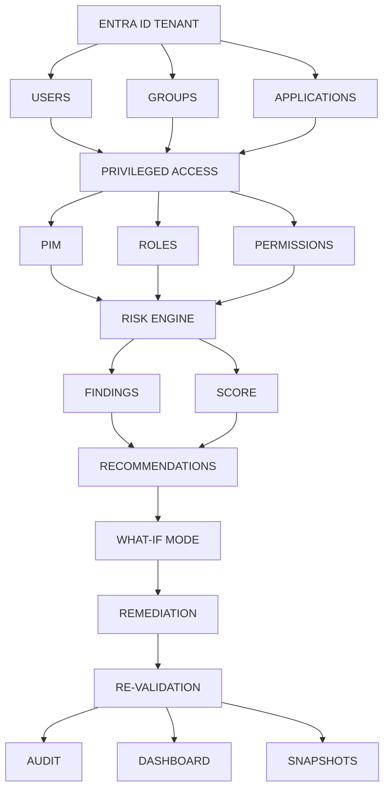

# [SHIELD] Entra ID Privileged Access & Identity Risk Assessment Toolkit

> **Mission:** Discover, assess, prioritize, explain, remediate, and continuously audit identity and privileged-access risks in Microsoft Entra ID.

A single-file PowerShell CLI that runs an end-to-end identity governance pipeline against Microsoft Entra ID. Self-installing prerequisites, guarded remediation, full audit trail, and a self-contained HTML dashboard - all through one command.

**Live-verified:** discovers real PIM assignments, scores real principals, applies real remediations, and proves improvement through re-validation.

---

## [START] Quick Start - One Command

```powershell
git clone https://github.com/habibnp01-prog/Entra-ID-Privileged-Access-Risk-Assessment-Toolkit.git
cd Entra-ID-Privileged-Access-Risk-Assessment-Toolkit

# Full read-only pipeline: Discover + Plan + Scenarios + Snapshot + AccessReview + Dashboard + Audit
.\Invoke-EntraToolkit.ps1 -Action Full -MinTier Medium
```

That's it. The script detects missing modules, offers to install them, prompts you to sign in to Microsoft Graph, and produces every artifact in `./output/`.

---

## [ARCH] Architecture & Flow



---

## [TARGET] Unified CLI - 12 Actions

One file, one command:

```powershell
.\Invoke-EntraToolkit.ps1 -Action <verb> [options]
```

| Action | Purpose | Graph | Writes |
|--------|---------|-------|--------|
| `Status` | Show current toolkit state | - | - |
| `Discover` | Full assessment (PIM + permanent + scoring) | READ | - |
| `Plan` | Generate Markdown remediation plan | - | - |
| `Scenarios` | Auto-generate scenarios from live findings | - | - |
| `WhatIf` | Simulate a scenario (no tenant changes) | - | - |
| `Remediate` | Apply a scenario (dry-run default) | RW | with `-Apply` |
| `Revalidate` | Diff baseline vs current score reports | - | - |
| `Audit` | Export timestamped CSV + HTML bundle | - | - |
| `Dashboard` | Self-contained interactive HTML dashboard | - | - |
| `Snapshot` | Save a timestamped score snapshot for trend history | - | - |
| `AccessReview` | Generate access review plan (Markdown + JSON) | - | - |
| `Full` | 7-stage read-only pipeline (see below) | READ | - |

### Common flags

| Flag | Purpose |
|------|---------|
| `-MinTier Critical\|High\|Medium\|Low` | Threshold for Plan/Scenarios/Full |
| `-ScenarioPath <file>` | Target scenario for WhatIf/Remediate |
| `-Apply` | For Remediate: actually write to tenant (requires typed confirmation) |
| `-Force` | Skip typed confirmation (only with `-NonInteractive`) |
| `-NonInteractive` | Suppress prompts (for Azure Automation / Task Scheduler) |
| `-AutoInstall` | Install missing modules without asking |
| `-SkipGraphConnect` | Do not attempt Connect-MgGraph |

### The Full Pipeline (7 stages, ~10 seconds)

```
1. Discover     -> pulls PIM + permanent + scores identities
2. Plan         -> writes RemediationPlan.md
3. Scenarios    -> auto-generates scenarios/generated/*.json
4. Snapshot     -> writes output/history/score-<timestamp>.json
5. AccessReview -> writes AccessReviewPlan.md + AccessReviewPlan.json
6. Dashboard    -> writes output/dashboard.html
7. Audit        -> writes output/audit-<timestamp>/
```

Every stage is read-only. The Full pipeline **never** writes to your tenant.

### Example sessions

```powershell
# Full read-only pipeline (safest default)
.\Invoke-EntraToolkit.ps1 -Action Full -MinTier Medium

# Just the dashboard
.\Invoke-EntraToolkit.ps1 -Action Dashboard

# Simulate a scenario (no tenant changes)
.\Invoke-EntraToolkit.ps1 -Action WhatIf -ScenarioPath .\scenarios\generated\someone.scenario.json

# Dry-run remediation
.\Invoke-EntraToolkit.ps1 -Action Remediate -ScenarioPath .\scenarios\generated\someone.scenario.json

# Live remediation (typed confirmation required)
.\Invoke-EntraToolkit.ps1 -Action Remediate -ScenarioPath .\scenarios\generated\someone.scenario.json -Apply

# Fully unattended pipeline (Azure Automation / Task Scheduler)
.\Invoke-EntraToolkit.ps1 -Action Full -MinTier Medium -NonInteractive -AutoInstall
```

---

## [LOCK] Safety Model

Every write path is guarded by **multiple independent layers**:

| Layer | Guarantee |
|-------|-----------|
| **Dry-run by default** | Remediation previews changes but never writes unless `-Apply` is set |
| **Typed confirmation** | Live writes require typing `yes` at the prompt (defeats accidental Enter) |
| **NonInteractive + Force** | Unattended automation only bypasses the prompt when *both* flags are set |
| **Last-GA guard** | Refuses to remove the last permanent Global Administrator |
| **Write-scope enforcement** | Executor verifies `RoleManagement.ReadWrite.Directory` before writing; refuses if missing |
| **Honest failure reporting** | Graph errors are logged as failures, never as success; false positives are corrected |
| **Full audit trail** | Every action (real or simulated) logged to `output/RemediationAudit.log` |
| **Read-only scheduler** | `Invoke-ScheduledAssessment.ps1` and `-Action Full` never apply remediation |

### Verified end-to-end

The toolkit has been tested live against a real Entra tenant:

```
[LIVE] RemoveEligible | role=Intune Administrator | result=ELIGIBLE_REMOVED
PIM assignments: 11 -> 10
Mohammad Habib Khan: 35 -> 30 (Medium)
Aggregate score: 100 -> 95
```

---

## [CHART] Risk Scoring Model

Each finding contributes a weighted score per principal:

| Finding | Weight |
|---------|--------|
| Permanent + high-privilege role | 50 |
| Permanent + standard role | 25 |
| Active PIM + high-privilege role | 20 |
| Eligible PIM + high-privilege role | 10 |
| No-expiration eligible assignment | 5 |
| Other eligible assignment | 2 |

If a principal holds **3 or more** high-privilege roles, a **x1.5 blast-radius multiplier** is applied. Scores cap at 100.

Tiers: `Critical >=80`, `High >=50`, `Medium >=25`, `Low <25`.

---

## [FOLDER] Repository Structure

```
Invoke-EntraToolkit.ps1                    # Unified CLI (12 actions, single entry point)
scripts/
|-- Invoke-EntraRiskAssessment.ps1         # 3-step assessment pipeline
|-- Invoke-ScheduledAssessment.ps1         # Unattended read-only wrapper
+-- RiskEngine/
|   |-- Get-EntraPIMEligibilityReport.ps1
|   |-- Get-EntraPermanentRoleReport.ps1
|   |-- Get-EntraRiskScore.ps1
|   |-- Invoke-WhatIfSimulation.ps1
|   +-- Get-EntraPrivilegedAccessReport.ps1
+-- Remediation/
    |-- New-EntraRemediationPlan.ps1
    |-- New-AutoRemediationScenarios.ps1
    |-- Invoke-EntraRemediation.ps1
    |-- Compare-EntraRemediationOutcome.ps1
    |-- Export-EntraAuditBundle.ps1
    |-- New-EntraDashboard.ps1
    |-- Save-EntraScoreSnapshot.ps1
    +-- New-EntraAccessReviewPlan.ps1

tests/
|-- Get-EntraRiskScore.Tests.ps1
|-- New-AutoRemediationScenarios.Tests.ps1
+-- fixtures/

scenarios/
|-- example-scenario.json
|-- demo-safe-live-remove-eligible.json
+-- generated/                              # Auto-generated (gitignored)

docs/
|-- WORKFLOW.md
+-- AUDIT.md

output/                                     # Generated artifacts (gitignored)
```

---

## [LOOP] End-to-End Workflow

```
1. Invoke-EntraToolkit.ps1 -Action Discover      -> live tenant data + scoring
2. Copy RiskScoreReport.json to .baseline.json   -> snapshot for re-validation
3. Invoke-EntraToolkit.ps1 -Action Plan          -> read the runbook
4. Invoke-EntraToolkit.ps1 -Action Scenarios     -> data-driven scenarios
5. Invoke-EntraToolkit.ps1 -Action WhatIf        -> simulate impact
6. Invoke-EntraToolkit.ps1 -Action Remediate     -> dry-run, then -Apply
7. Invoke-EntraToolkit.ps1 -Action Discover      -> re-scan tenant
8. Invoke-EntraToolkit.ps1 -Action Revalidate    -> diff + audit
9. Invoke-EntraToolkit.ps1 -Action Snapshot      -> record the trend
10. Invoke-EntraToolkit.ps1 -Action Dashboard    -> visualize
11. Invoke-EntraToolkit.ps1 -Action AccessReview -> governance plan
12. Invoke-EntraToolkit.ps1 -Action Audit        -> final bundle
```

Or everything at once:

```
Invoke-EntraToolkit.ps1 -Action Full -MinTier Medium
```

---

## [GEAR] Prerequisites

- Microsoft Entra ID **P2** or **Governance** license (for PIM)
- A user with `Privileged Role Administrator` or `Global Administrator`
- PowerShell 5.1+ (7+ recommended)

**You don't need to install any modules manually.** `Invoke-EntraToolkit.ps1` prompts on first run and installs these submodules with `-Scope CurrentUser`:

- `Microsoft.Graph.Authentication`
- `Microsoft.Graph.Identity.Governance`
- `Microsoft.Graph.Identity.DirectoryManagement`

**For live remediation**, you additionally need the `RoleManagement.ReadWrite.Directory` scope — the executor verifies this before writing and refuses if missing.

---

## [TOOLS] Roadmap

See the pinned [Roadmap issue](https://github.com/habibnp01-prog/Entra-ID-Privileged-Access-Risk-Assessment-Toolkit/issues) for planned work.

**Next up:**
- Pester tests for the remediation executor
- Azure Automation deployment templates
- Conditional Access correlation analysis

## [HANDSHAKE] Contributing

Contributions welcome. Open an issue first to discuss the change. Ensure scripts pass `PSScriptAnalyzer`.

## [LICENSE] License

MIT License - see `LICENSE` for details.