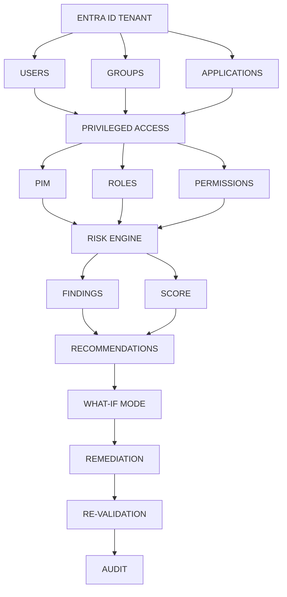

# 🛡️ Entra ID Privileged Access & Identity Risk Assessment Toolkit

> **Mission:** Discover, assess, prioritize, explain, remediate, and continuously audit identity and privileged-access risks in Microsoft Entra ID.

This toolkit provides a comprehensive pipeline for Identity Governance in Microsoft Entra ID. It moves beyond simple reporting by integrating a **Risk Engine** that correlates user identities, groups, applications, and privileged access configurations (PIM / Roles / Permissions) to generate actionable **Findings**, **Scores**, and **Remediation** paths.

---

## 🏗️ Architecture & Flow



---

## 🎯 Core Capabilities

### 1. Discovery & Assessment
- **Inventory:** Enumerates Users, Groups, and Applications within the tenant.
- **Privileged Access Mapping:** Identifies PIM eligible/active assignments, permanent roles, and high-risk permissions.
- **PIM Analysis:** Inspects PIM policy configurations to identify governance gaps.

### 2. Risk Engine & Scoring
- **Correlation:** Links identities to privileged roles and cross-tenant applications.
- **Findings:** Flags issues such as permanent Global Admin access or inactive PIM eligible assignments.
- **Scoring:** Assigns a quantifiable risk score based on severity and blast radius.

### 3. Remediation & Auditing
- **What-If Mode:** Simulates the impact of proposed changes before applying them.
- **Remediation Scripts:** Generates or executes Microsoft Graph PowerShell commands to enforce least privilege.
- **Re-validation:** Automatically re-scans to verify effectiveness.
- **Audit Trail:** Outputs a timestamped record of findings, actions, and validation results.

---

## 🛠️ Prerequisites

- **License:** Microsoft Entra ID P2 (for PIM) or Microsoft Entra ID Governance.
- **Permissions:** `Privileged Role Administrator` or `Global Administrator`, plus Microsoft Graph scopes such as `RoleManagement.ReadWrite.Directory`.
- **Environment:** PowerShell 7+ with the `Microsoft.Graph` module.

```powershell
Install-Module Microsoft.Graph -Scope CurrentUser -Force
```

---

## 🚀 Quick Start

1. **Clone the repository:**
   ```bash
   git clone https://github.com/habibnp01-prog/Entra-ID-Privileged-Access-Risk-Assessment-Toolkit.git
   ```

2. **Connect to Microsoft Graph:**
   ```powershell
   Connect-MgGraph -Scopes "RoleManagement.ReadWrite.Directory","Directory.Read.All"
   ```

3. **Run the Risk Assessment:**
   ```powershell
   ./scripts/RiskEngine/Get-EntraPrivilegedAccessReport.ps1
   ```

4. **Review Findings:**
   Output is written to `./output/` as JSON.

---

## 📂 Repository Structure

```
.github/              Issue & PR templates
docs/                 Deep-dive documentation
images/               Diagrams & screenshots
output/               Generated reports (gitignored)
scripts/
  ├── RiskEngine/     Discovery, findings, scoring
  └── Remediation/    What-If, fixes, re-validation
.gitignore
README.md
LICENSE
```

---

## 🤝 Contributing

Contributions welcome. Please open an issue first to discuss what you would like to change. Ensure scripts adhere to PSScriptAnalyzer standards.

## 📜 License

MIT License — see `LICENSE` for details.